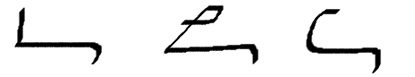
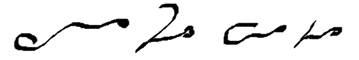
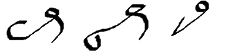
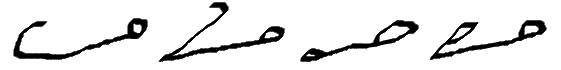
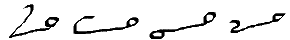
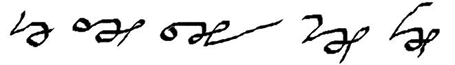
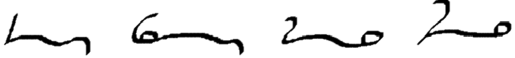
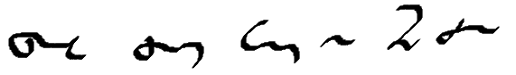
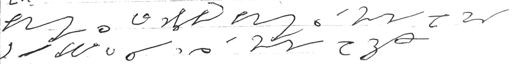

# Melin 

The Melin shorthand was created by Olof Melin a swedish army officer and Stenography teacher and historian. He was a teacher of Gabelsberger for a long time, but found out that there was some parts of it that made him dissatisfied, and he started working out his own shorthand.

Melin shorthand is based upon the principle that stuff should be comfortable and fast to write, rather to be as terse and short as possible, this can make some words look quite stretched out, but the good thing is that it's almost devoid of uncomfortable joins, and specific joining rules.

Also the shorthand comes in multiple stages where you have the base language, and then a debate language that uses tricks like shading and positioning and more drastic briefs to achieve a higher speed. Melin has been the official stenography for the swedish parliament for years, so it's a capable and at least for me a good looking system.

## The alphabet

The Melin base alphabet like most germanic cursive shorthands are using a system where consonants goes in one directions, and vowels in the other, for Melin specifically all consonant sounds are written from the top down, and the vowels from the top up, this is what makes Melin have the kind of cursive look, this also can mean that some words looks like they will get very vertical at first, but in my experience it's built in a way that makes it very linear, with some outliers that are more on the tall side.

### The base alphabet

This is the base alphabet for Melin, the one thing that I have a problem with here is the shading difference between v and w, but I tend to just write them both with the same glyph and I have not have any problems with it so far. There are a couple of things that you should keep in mind here, height and length are important for the letters, and it's something that can help you learn as well, letters that are similar often have similar glyphs, look at t and d for example, the **t** is just a half size **d**. This in theory would already make us able to write a bit more comfortably than our normal handwriting, but it would still be rather slow, so then we come to the next part

#### Combining of letters "joins"

When joining letters in Melin it can happen that a part of one character "eats" part of another one, this is the case when an e is followed by a G for example, the top part of the E becomes a part of the top loop of the G, so it can look like the preceding character is a bit shorter than it's supposed to be but it's just because of this phenomenon. Because of this, some times looking at the relation of the bottom of the characters can some times be more helpful than looking at the tops.

###  Consonant clusters

The consonant clusters of Melin are basically briefs for common consonant clusters that you'll find in writing, they are built up quite regularly with most of the doubly high characters being a version of the letter preceded by an **s**, another thing to notice is that bending the bottom stem of a letter with a sharp downward ending (see **bt** **bt**) will add a t to the base-letter. For some of the doubly large letters, prepending an s doesn't really make sense (**b**, **f**, **h**) and these will instead be used to make -r combinations of letters.

### English specific clusters

For writing English, there are some things about the system that is usually used for writing Swedish, that we will have to adapt a bit for them to make sense, so here are some letter combinations that I've found very helpful for writing for myself.

Here is the justification for the modified letters:

* th is a half sized w since it's such a common letter, and it also bears a resemblence to a "softer" t sound
* kj doesn't appear in english, and the sign is repurposed as ch
* dge is an elongated j, to make it distinct from it and ch
* ä the sound doesn't appear in english and is repurposed as ei
* ai is a combination of a and j, to make it not grow so much vertically and still be comfortable and fast to write
* kv doesn't exist in english, but the sound is very close to qu so it's repurposed as that
* y in english is replacable with i since it doesn't use rounded lips like the scandinavian y, and this sign is therefore repurpoused as ou, as it looks like a modified å which ou sounds like a modified å :)

## Basic writing rules

Having the basic alphabet under control we can now start thinking about actually doing something productive. Melin is half orthographic half phonetic, in that it lets you write out stuff orthographically if you want to, but using phonetics to do shortcuts when you can to make words shorter and more comfortable, basically if something is more comfortable to write phonetically, that's what you should do, or else just use the orthographic form.

### Double letters

For double letters you *can* use a shaded character to make clear that you're using a double letter, in practice however I've not really found this necessary at all, basically what I do is to just write a single letter, and it's usually quite easy to get from context what is meant, also in languages like Norwegian which uses double characters quite a lot to differ between words, but the possibility is there, if you like me are not a big fan of shading, using a small tick over the middle point of the letter is also a thing you can do if you want to be really explicit, but since all of this is making the writing slower, and doesn't really hinder you much in reading back I'd advice to just skip marking doubles. For vowel sounds, like **ee** for example just use the letter that is actually sounded out (**i** phonetically) instead.

### Combining letters

Most of the time when you're writing you'll alternate between consonant or cluster to a vowel to another cluster, but some times this is not possible basically the letters flow up and down through the word, if you have to combine some consonants that don't have a cluster brief you either write the one under the previous character or you write a short connecting stroke (schwa/empty vowel) to connect it to the next letter or just use a short that brings it together or a phonetic version:

### Circle consonant combinations

Combining letters with the circle consonants can be a bit troublesome at first, but the basic rule is that "top-circles" get tacked to the left of a straight downwards character, while a "bottom-circle" character gets a short connection stroke. For the consonants with round feet the circle gets put inside the curve or under:

## Briefs

Melin has quite a list of briefs, and mostly these are just taken from the swedish briefs with the same meaning or sound briefs are often used as combinations in words to make them shorter, briefs such as **be**, **for**, and **-ing** for example are used a lot to make words such as BE-ING, or BE-FOR

## vowel sounds

For some of the vowels that look strange to English people å, ö, ä these are the following sounds in English

 ### å: 
 ou in b**ou**ght and c**ou**ght, f**ou**ght. 
 

 ### ö: 
 ea in l**ear**n, e in st**e**rn, f**e**rn, u in b**u**rn
 

 ### ä:
 is not used in English and is rather used for the diphtong ei
 ai in f**ai**led, s**ai**led b**ai**l
 

 ### i: 
 is used for the ee cluster in English f**ee**l, st**ea**l, r**ea**l, k**ee**l, 
 

 and also for other i sounds such as st**i**ll, f**i**ll, s**i**ll, m**i**ll etc.

 
 ### ai:
 for the sound of I, buy, like, psyche (sajki) dyke, spike etc.
 

 ### e:
 for most e and schwa's r**ea**dy, l**ea**d (as in the metal) sp**e**d, cr**e**d, s**ai**d, f**e**d etc
 

 ### ou:
 is used for b**oa**t, fl**ou**t , m**o**le st**o**le
 
 

 
 ### u:
 is used for oo s**oo**the, s**oo**t, f**oo**t, you, st**ew**, wh**o**
 

## Sample breakdowns

### Sample 1

#### Transliteration

kemi-ST-ri s wel teknika-LY kemi-ST-ri s THE ST-ødi of mate BT i prefer TO s-EI t as THE ST-ødi of CH-EI-DG 

#### Meaning

Chemistry is, well technically chemistry is the study of matter, but I prefer to say it as the study of change.

#### Points to ponder

First of all, this is a real text written at speed, so proportions and things can be a bit off, but when you get used to reading it's almost just as easy and clear as my normal handwriting at least to read

* c replaced with k, this is basically written phonetically
* r on the left side after the st cluster since it has a hard foot
* the brief for *the* is a short uptick in the upper part of the writing line
* ei and i is some times kind of blending together when writing like here, but it's not that hard to get from context
* change consist completely out of cluster letters, and it misses a bit of text, but it's essence is still there so it's still understandable.